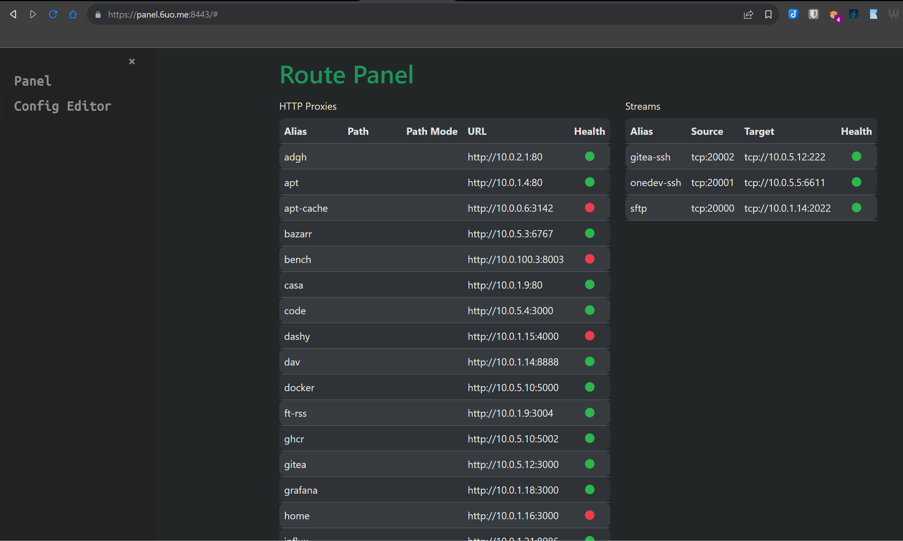
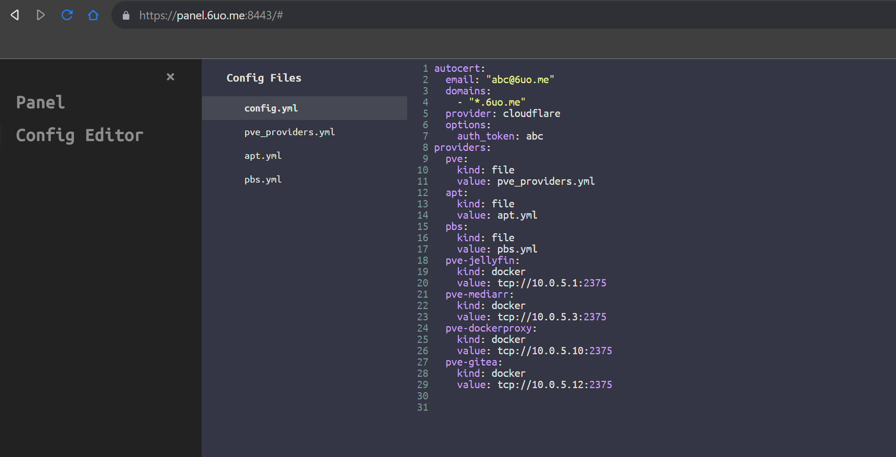

# go-proxy

A simple auto docker reverse proxy for home use. **Written in _Go_**

In the examples domain `x.y.z` is used, replace them with your domain

## Table of content

- [go-proxy](#go-proxy)
  - [Table of content](#table-of-content)
  - [Key Points](#key-points)
  - [How to use](#how-to-use)
    - [Binary](#binary)
    - [Docker](#docker)
  - [Command-line args](#command-line-args)
    - [Commands](#commands)
  - [Use JSON Schema in VSCode](#use-json-schema-in-vscode)
  - [Configuration](#configuration)
    - [Labels (docker)](#labels-docker)
    - [Environment variables](#environment-variables)
    - [Config File](#config-file)
      - [Fields](#fields)
      - [Provider Kinds](#provider-kinds)
    - [Provider File](#provider-file)
    - [Supported DNS Challenge Providers](#supported-dns-challenge-providers)
  - [Examples](#examples)
    - [Single port configuration example](#single-port-configuration-example)
    - [Multiple ports configuration example](#multiple-ports-configuration-example)
    - [TCP/UDP configuration example](#tcpudp-configuration-example)
  - [Load balancing Configuration Example](#load-balancing-configuration-example)
  - [Troubleshooting](#troubleshooting)
  - [Benchmarks](#benchmarks)
  - [Known issues](#known-issues)
  - [Memory usage](#memory-usage)
  - [Build it yourself](#build-it-yourself)

## Key Points

- Fast (See [benchmarks](#benchmarks))
- Auto certificate obtaining and renewal (See [Config File](#config-file) and [Supported DNS Challenge Providers](#supported-dns-challenge-providers))
- Auto detect reverse proxies from docker
- Auto hot-reload on container `start` / `die` / `stop` or config file changes
- Custom proxy entries with `config.yml` and additional provider files
- Subdomain matching + Path matching **(domain name doesn't matter)**
- HTTP(s) proxy + TCP/UDP Proxy (UDP is _experimental_)
- HTTP(s) round robin load balance support (same subdomain and path across different hosts)
- Simple panel to see all reverse proxies and health available on port 8080 (http) and port 8443 (https)

  

- Config editor to edit config and provider files with validation

  **Validate and save file with Ctrl+S**

  

## How to use

1. Clone the repository `git clone https://github.com/yusing/go-proxy && cd go-proxy`

2. Call `make setup` to init config file, provider file, and docker compose file

3. Point your domain (i.e `y.z`) to your machine's IP address

   - A Record: `*.y.z` -> `10.0.10.1`
   - AAAA Record: `*.y.z` -> `::ffff:a00:a01`

4. Start `go-proxy` (see [Binary](#binary) or [docker](#docker))

5. Start editing config files
    - with text editor (i.e. Visual Studio Code)
    - with web config editor by navigate to `ip:8080`

### Binary

1. (Optional) enabled HTTPS

   - Use autocert feature by completing `autocert` in `config.yml`

   - Use existing certificate

     Prepare your wildcard (`*.y.z`) SSL cert in `certs/`

     - cert / chain / fullchain: `certs/cert.crt`
     - private key: `certs/priv.key`

2. run the binary `bin/go-proxy`

3. enjoy

### Docker

1. Copy content from [compose.example.yml](compose.example.yml) and create your own `compose.yml`

2. Add networks to make sure it is in the same network with other containers, or make sure `proxy.<alias>.host` is reachable

3. (Optional) enable HTTPS

   - Use autocert feature by completing `autocert` section in `config/config.yml` and mount `certs/` to `/app/certs` in order to store obtained certs

   - Use existing certificate by mount your wildcard (`*.y.z`) SSL cert

     - cert / chain / fullchain -> `/app/certs/cert.crt`
     - private key -> `/app/certs/priv.key`

4. Start `go-proxy` with `docker compose up -d` or `make up`.

5. (Optional) If you are using ufw with vpn that drop all inbound traffic except vpn, run below to allow docker containers to connect to `go-proxy`

   In case the network of your container is in subnet `172.16.0.0/16` (bridge),
   and vpn network is under `100.64.0.0/10` (i.e. tailscale)

   `sudo ufw allow from 172.16.0.0/16 to 100.64.0.0/10`

   You can also list CIDRs of all docker bridge networks by:

   `docker network inspect $(docker network ls | awk '$3 == "bridge" { print $1}') | jq -r '.[] | .Name + " " + .IPAM.Config[0].Subnet' -`

6. start your docker app, and visit <container_name>.y.z

7. check the logs with `docker compose logs` or `make logs` to see if there is any error, check panel at [panel port] for active proxies

## Command-line args

`go-proxy [command]`

### Commands

- empty: start proxy server
- validate: validate config and exit
- reload: force reload config and exit

## Use JSON Schema in VSCode

Modify `.vscode/settings.json` to fit your needs

```json
{
  "yaml.schemas": {
    "https://github.com/yusing/go-proxy/raw/main/schema/config.schema.json": [
      "config.example.yml",
      "config.yml"
    ],
    "https://github.com/yusing/go-proxy/raw/main/schema/providers.schema.json": [
      "providers.example.yml",
      "*.providers.yml"
    ]
  }
}
```

## Configuration

With container name, no label needs to be added _(most of the time)_.

### Labels (docker)

See [compose.example.yml](compose.example.yml) for more

- `proxy.aliases`: comma separated aliases for subdomain matching

  - default: container name

- `proxy.*.<field>`: wildcard label for all aliases

Below labels has a **`proxy.<alias>`** prefix (i.e. `proxy.nginx.scheme: http`)

- `scheme`: proxy protocol
  - default: `http`
  - allowed: `http`, `https`, `tcp`, `udp`
- `host`: proxy host
  - default: `container_name`
- `port`: proxy port
  - default: first expose port (declared in `Dockerfile` or `docker-compose.yml`)
  - `http(s)`: number in range og `0 - 65535`
  - `tcp/udp`: `[<listeningPort>:]<targetPort>`
    - `listeningPort`: number, when it is omitted (not suggested), a free port starting from 20000 will be used.
    - `targetPort`: number, or predefined names (see [constants.go:14](src/go-proxy/constants.go#L14))
- `no_tls_verify`: whether skip tls verify when scheme is https
  - default: `false`
- `path`: proxy path _(http(s) proxy only)_
  - default: empty
- `path_mode`: mode for path handling

  - default: empty
  - allowed: empty, `forward`, `sub`
    - `empty`: remove path prefix from URL when proxying
      1. apps.y.z/webdav -> webdav:80
      2. apps.y.z./webdav/path/to/file -> webdav:80/path/to/file
    - `forward`: path remain unchanged
      1. apps.y.z/webdav -> webdav:80/webdav
      2. apps.y.z./webdav/path/to/file -> webdav:80/webdav/path/to/file
    - `sub`: (experimental) remove path prefix from URL and also append path to HTML link attributes (`src`, `href` and `action`) and Javascript `fetch(url)` by response body substitution
      e.g. apps.y.z/app1 -> webdav:80, `href="/app1/path/to/file"` -> `href="/path/to/file"`

- `load_balance`: enable load balance (docker only)
  - allowed: `1`, `true`

### Environment variables

- `GOPROXY_DEBUG`: set to `1` or `true` to enable debug behaviors (i.e. output, etc.)
- `GOPROXY_REDIRECT_HTTP`: set to `0` or `false` to disable http to https redirect (only when certs are located)

### Config File

See [config.example.yml](config.example.yml) for more

#### Fields

- `autocert`: autocert configuration

  - `email`: ACME Email
  - `domains`: a list of domains for cert registration
  - `provider`: DNS Challenge provider, see [Supported DNS Challenge Providers](#supported-dns-challenge-providers)
  - `options`: provider specific options

- `providers`: reverse proxy providers configuration
  - `kind`: provider kind (string), see [Provider Kinds](#provider-kinds)
  - `value`: provider specific value

#### Provider Kinds

- `docker`: load reverse proxies from docker

  values:

  - `FROM_ENV`: value from environment
  - full url to docker host (i.e. `tcp://host:2375`)

- `file`: load reverse proxies from provider file

  value: relative path of file to `config/`

### Provider File

Fields are same as [docker labels](#labels-docker) starting from `scheme`

See [providers.example.yml](providers.example.yml) for examples

### Supported DNS Challenge Providers

- Cloudflare

  - `auth_token`: your zone API token

  Follow [this guide](https://cloudkul.com/blog/automcatic-renew-and-generate-ssl-on-your-website-using-lego-client/) to create a new token with `Zone.DNS` read and edit permissions

To add more provider support (**CloudDNS** as an example):

1. Fork this repo, modify [autocert.go](src/go-proxy/autocert.go#L305)

   ```go
   var providersGenMap = map[string]ProviderGenerator{
     "cloudflare": providerGenerator(cloudflare.NewDefaultConfig, cloudflare.NewDNSProviderConfig),
     // add here, i.e.
     "clouddns": providerGenerator(clouddns.NewDefaultConfig, clouddns.NewDNSProviderConfig),
   }
   ```

2. Go to [https://go-acme.github.io/lego/dns/clouddns](https://go-acme.github.io/lego/dns/clouddns/) and check for required config

3. Build `go-proxy` with `make build`

4. Set required config in `config.yml` `autocert` -> `options` section

   ```shell
   # From https://go-acme.github.io/lego/dns/clouddns/
   CLOUDDNS_CLIENT_ID=bLsdFAks23429841238feb177a572aX \
   CLOUDDNS_EMAIL=you@example.com \
   CLOUDDNS_PASSWORD=b9841238feb177a84330f \
   lego --email you@example.com --dns clouddns --domains my.example.org run
   ```

   Should turn into:

   ```yaml
   autocert:
     ...
     options:
       client_id: bLsdFAks23429841238feb177a572aX
       email: you@example.com
       password: b9841238feb177a84330f
   ```

5. Run and test if it works
6. Commit and create pull request

## Examples

### Single port configuration example

```yaml
# (default) https://<container_name>.y.z
whoami:
  image: traefik/whoami
  container_name: whoami # => whoami.y.z

# enable both subdomain and path matching:
whoami:
  image: traefik/whoami
  container_name: whoami
  labels:
    - proxy.aliases=whoami,apps
    - proxy.apps.path=/whoami
# 1. visit https://whoami.y.z
# 2. visit https://apps.y.z/whoami
```

### Multiple ports configuration example

```yaml
minio:
  image: quay.io/minio/minio
  container_name: minio
  ...
  labels:
    - proxy.aliases=minio,minio-console
    - proxy.minio.port=9000
    - proxy.minio-console.port=9001

# visit https://minio.y.z to access minio
# visit https://minio-console.y.z/whoami to access minio console
```

### TCP/UDP configuration example

```yaml
# In the app
app-db:
  image: postgres:15
  container_name: app-db
  ...
  labels:
    # Optional (postgres is in the known image map)
    - proxy.app-db.scheme=tcp

    # Optional (first free port will be used for listening port)
    - proxy.app-db.port=20000:postgres

# In go-proxy
go-proxy:
  ...
  ports:
    - 80:80
    ...
    - 20000:20000/tcp
    # or 20000-20010:20000-20010/tcp to declare large range at once

# access app-db via <*>.y.z:20000
```

## Load balancing Configuration Example

```yaml
nginx:
  ...
  deploy:
    mode: replicated
    replicas: 3
  labels:
    - proxy.nginx.load_balance=1 # allowed: [1, true]
```

## Troubleshooting

Q: How to fix when it shows "no matching route for subdomain \<subdomain>"?

A: Make sure the container is running, and \<subdomain> matches any container name / alias

## Benchmarks

Benchmarked with `wrk` connecting `traefik/whoami`'s `/bench` endpoint

Remote benchmark (client running wrk and `go-proxy` server are different devices)

- Direct connection

  ```shell
  root@yusing-pc:~# wrk -t 10 -c 200 -d 10s -H "Host: bench.6uo.me" --latency http://10.0.100.3:8003/bench
  Running 10s test @ http://10.0.100.3:8003/bench
    10 threads and 200 connections
    Thread Stats   Avg      Stdev     Max   +/- Stdev
      Latency    94.75ms  199.92ms   1.68s    91.27%
      Req/Sec     4.24k     1.79k   18.79k    72.13%
    Latency Distribution
      50%    1.14ms
      75%  120.23ms
      90%  245.63ms
      99%    1.03s
    423444 requests in 10.10s, 50.88MB read
    Socket errors: connect 0, read 0, write 0, timeout 29
  Requests/sec:  41926.32
  Transfer/sec:      5.04MB
  ```

- With reverse proxy

  ```shell
  root@yusing-pc:~# wrk -t 10 -c 200 -d 10s -H "Host: bench.6uo.me" --latency http://10.0.1.7/bench
  Running 10s test @ http://10.0.1.7/bench
    10 threads and 200 connections
    Thread Stats   Avg      Stdev     Max   +/- Stdev
      Latency    79.35ms  169.79ms   1.69s    92.55%
      Req/Sec     4.27k     1.90k   19.61k    75.81%
    Latency Distribution
      50%    1.12ms
      75%  105.66ms
      90%  200.22ms
      99%  814.59ms
    409836 requests in 10.10s, 49.25MB read
    Socket errors: connect 0, read 0, write 0, timeout 18
  Requests/sec:  40581.61
  Transfer/sec:      4.88MB
  ```

Local benchmark (client running wrk and `go-proxy` server are under same proxmox host but different LXCs)

- Direct connection

  ```shell
  root@http-benchmark-client:~# wrk -t 10 -c 200 -d 10s --latency http://10.0.100.1/bench
  Running 10s test @ http://10.0.100.1/bench
    10 threads and 200 connections
    Thread Stats   Avg      Stdev     Max   +/- Stdev
      Latency   434.08us  539.35us   8.76ms   85.28%
      Req/Sec    67.71k     6.31k   87.21k    71.20%
    Latency Distribution
      50%  153.00us
      75%  646.00us
      90%    1.18ms
      99%    2.38ms
    6739591 requests in 10.01s, 809.85MB read
  Requests/sec: 673608.15
  Transfer/sec:     80.94MB
  ```

- With `go-proxy` reverse proxy

  ```shell
  root@http-benchmark-client:~# wrk -t 10 -c 200 -d 10s -H "Host: bench.6uo.me" --latency http://10.0.1.7/bench
  Running 10s test @ http://10.0.1.7/bench
    10 threads and 200 connections
    Thread Stats   Avg      Stdev     Max   +/- Stdev
      Latency     1.23ms    0.96ms  11.43ms   72.09%
      Req/Sec    17.48k     1.76k   21.48k    70.20%
    Latency Distribution
      50%    0.98ms
      75%    1.76ms
      90%    2.54ms
      99%    4.24ms
    1739079 requests in 10.01s, 208.97MB read
  Requests/sec: 173779.44
  Transfer/sec:     20.88MB
  ```

- With `traefik-v3`

  ```shell
  root@traefik-benchmark:~# wrk -t10 -c200 -d10s -H "Host: benchmark.whoami" --latency http://127.0.0.1:8000/bench
  Running 10s test @ http://127.0.0.1:8000/bench
    10 threads and 200 connections
    Thread Stats   Avg      Stdev     Max   +/- Stdev
      Latency     2.81ms   10.36ms 180.26ms   98.57%
      Req/Sec    11.35k     1.74k   13.76k    85.54%
    Latency Distribution
      50%    1.59ms
      75%    2.27ms
      90%    3.17ms
      99%   37.91ms
    1125723 requests in 10.01s, 109.50MB read
  Requests/sec: 112499.59
  Transfer/sec:     10.94MB
  ```

## Known issues

None

## Memory usage

It takes ~15 MB for 50 proxy entries

## Build it yourself

1. Install / Upgrade [go (>=1.22)](https://go.dev/doc/install) and `make` if not already

2. Clear cache if you have built this before (go < 1.22) with `go clean -cache`

3. get dependencies with `make get`

4. build binary with `make build`

5. start your container with `make up` (docker) or `bin/go-proxy` (binary)
