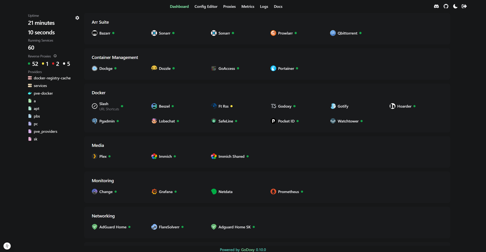
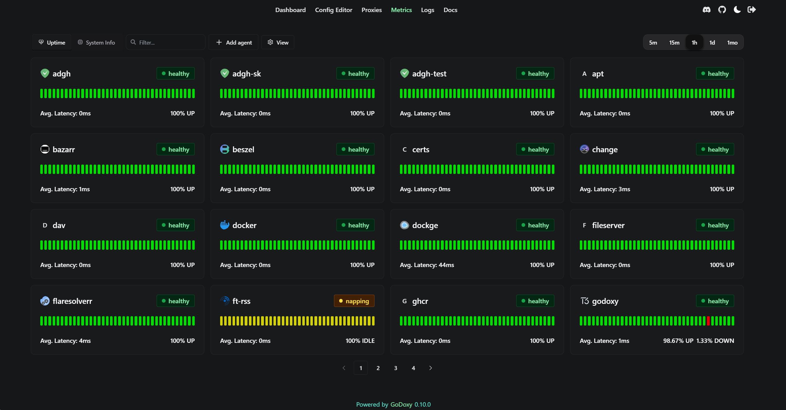
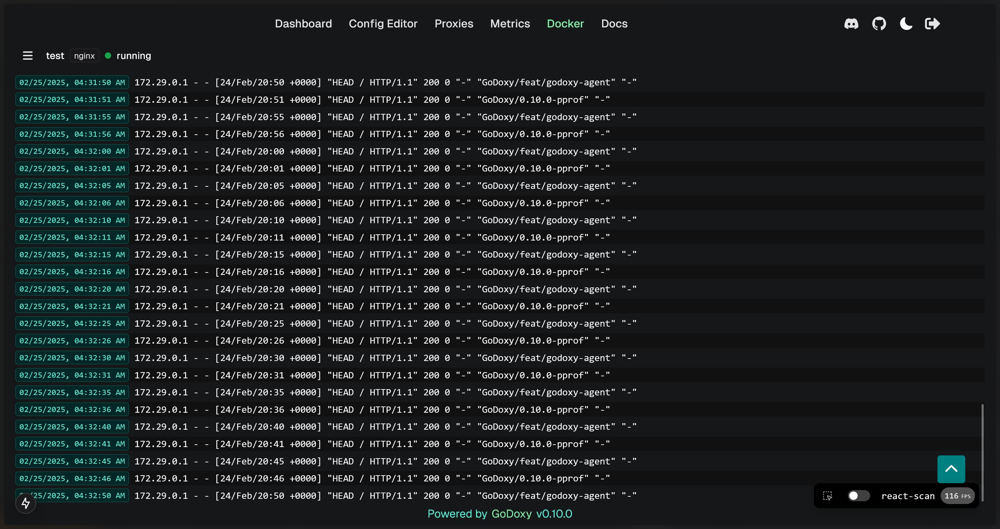
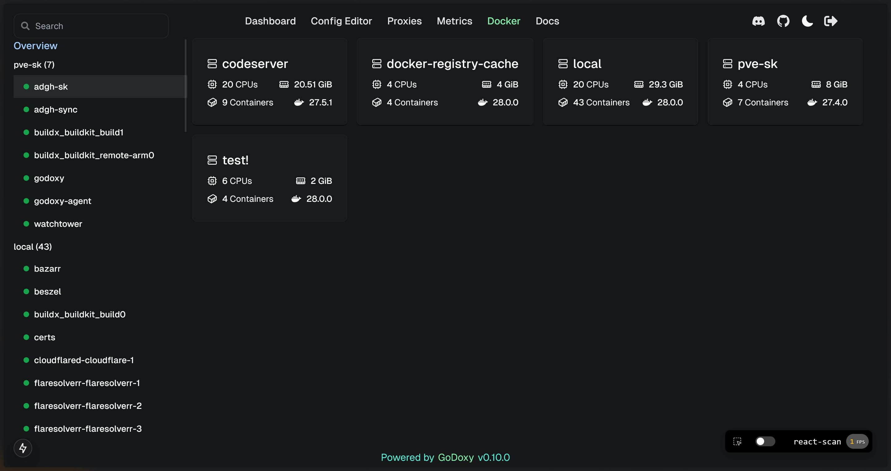
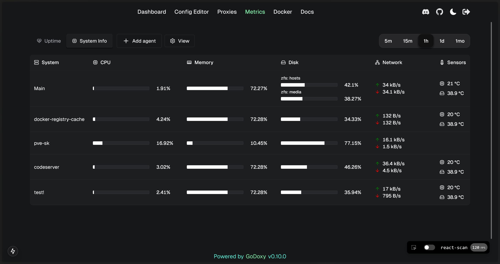
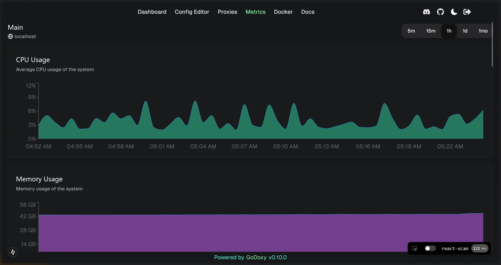

<div align="center">

# GoDoxy

[](https://sonarcloud.io/summary/new_code?id=yusing_godoxy)

[](https://sonarcloud.io/summary/new_code?id=yusing_godoxy)
[](https://discord.gg/umReR62nRd)

A lightweight, simple, and [performant](https://github.com/yusing/godoxy/wiki/Benchmarks) reverse proxy with WebUI.

For full documentation, check out **[Wiki](https://github.com/yusing/godoxy/wiki)**

**EN** | <a href="README_CHT.md">中文</a>

**Currently working on [feat/godoxy-agent](https://github.com/yusing/godoxy/tree/feat/godoxy-agent).<br/>For contribution, please fork this instead of default branch.**

<!-- [](https://sonarcloud.io/summary/new_code?id=yusing_go-proxy)
[](https://sonarcloud.io/summary/new_code?id=yusing_go-proxy)
[](https://sonarcloud.io/summary/new_code?id=yusing_go-proxy) -->



</div>

## Table of content

<!-- TOC -->

- [GoDoxy](#godoxy)
  - [Table of content](#table-of-content)
  - [Key Features](#key-features)
  - [Prerequisites](#prerequisites)
  - [How does GoDoxy work](#how-does-godoxy-work)
  - [Setup](#setup)
  - [Screenshots](#screenshots)
    - [idlesleeper](#idlesleeper)
    - [Metrics and Logs](#metrics-and-logs)
  - [Manual Setup](#manual-setup)
    - [Folder structrue](#folder-structrue)
  - [Build it yourself](#build-it-yourself)

## Key Features

- Easy to use
  - Effortless configuration
  - Simple multi-node setup with GoDoxy agents
  - Error messages is clear and detailed, easy troubleshooting
- Auto SSL with Let's Encrypt and DNS-01 (See [Supported DNS-01 Challenge Providers](https://github.com/yusing/go-proxy/wiki/Supported-DNS%E2%80%9001-Providers))
- Auto hot-reload on container state / config file changes
- Create routes dynamically from running docker containers
- **idlesleeper**: stop containers on idle, wake it up on traffic _(optional, see [screenshots](#idlesleeper))_
- HTTP reserve proxy and TCP/UDP port forwarding
- OpenID Connect integration
- [HTTP middleware](https://github.com/yusing/go-proxy/wiki/Middlewares) and [Custom error pages support](https://github.com/yusing/go-proxy/wiki/Middlewares#custom-error-pages)
- **Web UI with App dashboard, config editor, _uptime monitor_, _system monitor_, _docker logs viewer_ (available on nightly builds)**
- Supports linux/amd64, linux/arm64
- Written in **[Go](https://go.dev)**

[🔼Back to top](#table-of-content)

## Prerequisites

Setup Wildcard DNS Record(s) for machine running `GoDoxy`, e.g.

- A Record: `*.domain.com` -> `10.0.10.1`
- AAAA Record (if you use IPv6): `*.domain.com` -> `::ffff:a00:a01`

## How does GoDoxy work

1. List all the containers
2. Read container name, labels and port configurations for each of them
3. Create a route if applicable (a route is like a "Virtual Host" in NPM)

GoDoxy uses the label `proxy.aliases` as the subdomain(s), if unset it defaults to `container_name`.

For example, with the label `proxy.aliases: qbt` you can access your app via `qbt.domain.com`.

## Setup

**NOTE:** GoDoxy is designed to be (and only works when) running in `host` network mode, do not change it. To change listening ports, modify `.env`.

1. Prepare a new directory for docker compose and config files.

2. Run setup script inside the directory, or [set up manually](#manual-setup)

    ```shell
    /bin/bash -c "$(curl -fsSL https://raw.githubusercontent.com/yusing/godoxy/main/scripts/setup.sh)"
    ```

3. Start the container `docker compose up -d` and wait for it to be ready

4. You may now do some extra configuration on WebUI `https://godoxy.yourdomain.com`

[🔼Back to top](#table-of-content)

## Screenshots

### idlesleeper


### Metrics and Logs

_In development, available on nightly builds._

<div align="center">
  <table>
    <tr>
      <td align="center"></td>
      <td align="center"></td>
      <td align="center"></td>
    </tr>
    <tr>
      <td align="center"><b>Uptime Monitor</b></td>
      <td align="center"><b>Docker Logs</b></td>
      <td align="center"><b>Server Overview</b></td>
    </tr>
        <tr>
      <td align="center"></td>
      <td align="center"></td>
    </tr>
    <tr>
      <td align="center"><b>System Monitor</b></td>
      <td align="center"><b>Graphs</b></td>
    </tr>
  </table>
</div>

[🔼Back to top](#table-of-content)

## Manual Setup

1. Make `config` directory then grab `config.example.yml` into `config/config.yml`

   `mkdir -p config && wget https://raw.githubusercontent.com/yusing/godoxy/main/config.example.yml -O config/config.yml`

2. Grab `.env.example` into `.env`

   `wget https://raw.githubusercontent.com/yusing/godoxy/main/.env.example -O .env`

3. Grab `compose.example.yml` into `compose.yml`

   `wget https://raw.githubusercontent.com/yusing/godoxy/main/compose.example.yml -O compose.yml`

### Folder structrue

```shell
├── certs
│   ├── cert.crt
│   └── priv.key
├── compose.yml
├── config
│   ├── config.yml
│   ├── middlewares
│   │   ├── middleware1.yml
│   │   ├── middleware2.yml
│   ├── provider1.yml
│   └── provider2.yml
├── data
│   ├── metrics # metrics data
│   │   ├── uptime.json
│   │   └── system_info.json
└── .env
```

## Build it yourself

1. Clone the repository `git clone https://github.com/yusing/godoxy --depth=1`

2. Install / Upgrade [go (>=1.22)](https://go.dev/doc/install) and `make` if not already

3. Clear cache if you have built this before (go < 1.22) with `go clean -cache`

4. get dependencies with `make get`

5. build binary with `make build`

[🔼Back to top](#table-of-content)
