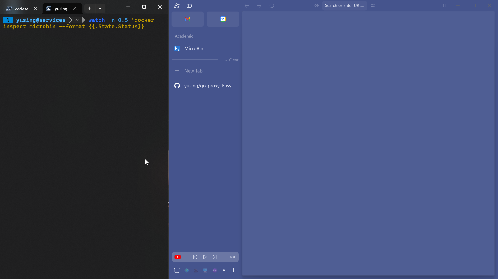

<div align="center">

# GoDoxy

[](https://sonarcloud.io/summary/new_code?id=yusing_go-proxy)

[](https://sonarcloud.io/summary/new_code?id=yusing_go-proxy)
[](https://discord.gg/umReR62nRd)

輕量、易用、 [高效能](https://github.com/yusing/go-proxy/wiki/Benchmarks)，且帶有主頁和配置面板的反向代理

完整文檔請查閱 **[Wiki](https://github.com/yusing/go-proxy/wiki)**（暫未有中文翻譯）

<!-- [](https://sonarcloud.io/summary/new_code?id=yusing_go-proxy)
[](https://sonarcloud.io/summary/new_code?id=yusing_go-proxy)
[](https://sonarcloud.io/summary/new_code?id=yusing_go-proxy) -->

<a href="README.md">EN</a> | **中文**


</div>

## 目錄

<!-- TOC -->

- [GoDoxy](#godoxy)
  - [目錄](#目錄)
  - [主要特點](#主要特點)
  - [前置需求](#前置需求)
  - [安裝](#安裝)
    - [手動安裝](#手動安裝)
    - [資料夾結構](#資料夾結構)
    - [在 VSCode 中使用 JSON Schema](#在-vscode-中使用-json-schema)
  - [截圖](#截圖)
    - [閒置休眠](#閒置休眠)
  - [自行編譯](#自行編譯)

## 主要特點

- 容易使用
  - 輕鬆配置
  - 簡單的多節點設置
  - 錯誤訊息清晰詳細，易於排除故障
- 自動 SSL 憑證管理（參見 [支援的 DNS-01 驗證提供商](https://github.com/yusing/go-proxy/wiki/Supported-DNS%E2%80%9001-Providers)）
- 自動配置 Docker 容器
- 容器狀態/配置文件變更時自動熱重載
- **閒置休眠**：在閒置時停止容器，有流量時喚醒（_可選，參見[截圖](#閒置休眠)_）
- HTTP(s) 反向代理
- OpenID Connect 支持
- [HTTP 中介軟體支援](https://github.com/yusing/go-proxy/wiki/Middlewares)
- [自訂錯誤頁面支援](https://github.com/yusing/go-proxy/wiki/Middlewares#custom-error-pages)
- TCP 和 UDP 埠轉發
- **網頁介面，具有應用儀表板和配置編輯器**
- 支援 linux/amd64、linux/arm64
- 使用 **[Go](https://go.dev)** 編寫

[🔼回到頂部](#目錄)

## 前置需求

設置 DNS 記錄指向運行 `GoDoxy` 的機器，例如：

- A 記錄：`*.y.z` -> `10.0.10.1`
- AAAA 記錄：`*.y.z` -> `::ffff:a00:a01`

## 安裝

1.  拉取最新的 Docker 映像

    ```shell
    docker pull ghcr.io/yusing/go-proxy:latest
    ```

2.  建立新目錄，`cd` 進入後運行安裝，或[手動安裝](#手動安裝)

    ```shell
    docker run --rm -v .:/setup ghcr.io/yusing/go-proxy /app/godoxy setup
    ```

3.  _（可選）_ 設置網頁介面登入

    - 設置隨機 JWT 密鑰

      ```shell
      sed -i "s|API_JWT_SECRET=.*|API_JWT_SECRET=$(openssl rand -base64 32)|g" .env
      ```

    - 更改網頁介面認證的使用者名稱和密碼
      ```shell
      USERNAME=admin
      PASSWORD=some-password
      sed -i "s|API_USERNAME=.*|API_USERNAME=${USERNAME}|g" .env
      sed -i "s|API_PASSWORD=.*|API_PASSWORD=${PASSWORD}|g" .env
      ```

4.  _（可選）_ 設置其他 Docker 節點的 `docker-socket-proxy`（參見 [多 Docker 節點設置](https://github.com/yusing/go-proxy/wiki/Configurations#multi-docker-nodes-setup)），然後在 `config.yml` 中添加它們

5.  啟動容器 `docker compose up -d`

6.  大功告成!可前往WebUI `https://gp.domain.com` 進行額外的配置

[🔼回到頂部](#目錄)

### 手動安裝

1. 建立 `config` 目錄，然後將 `config.example.yml` 下載到 `config/config.yml`

   `mkdir -p config && wget https://raw.githubusercontent.com/yusing/go-proxy/v0.9/config.example.yml -O config/config.yml`

2. 將 `.env.example` 下載到 `.env`

   `wget https://raw.githubusercontent.com/yusing/go-proxy/v0.9/.env.example -O .env`

3. 將 `compose.example.yml` 下載到 `compose.yml`

   `wget https://raw.githubusercontent.com/yusing/go-proxy/v0.9/compose.example.yml -O compose.yml`

### 資料夾結構

```shell
├── certs
│   ├── cert.crt
│   └── priv.key
├── compose.yml
├── config
│   ├── config.yml
│   ├── middlewares
│   │   ├── middleware1.yml
│   │   ├── middleware2.yml
│   ├── provider1.yml
│   └── provider2.yml
└── .env
```

### 在 VSCode 中使用 JSON Schema

複製 [`.vscode/settings.example.json`](.vscode/settings.example.json) 到 `.vscode/settings.json` 並根據需要修改

[🔼回到頂部](#目錄)

## 截圖

### 閒置休眠



[🔼回到頂部](#目錄)

## 自行編譯

1. 克隆儲存庫 `git clone https://github.com/yusing/go-proxy --depth=1`

2. 如果尚未安裝，請安裝/升級 [go (>=1.22)](https://go.dev/doc/install) 和 `make`

3. 如果之前編譯過（go < 1.22），請使用 `go clean -cache` 清除快取

4. 使用 `make get` 獲取依賴

5. 使用 `make build` 編譯二進制檔案

[🔼回到頂部](#目錄)
