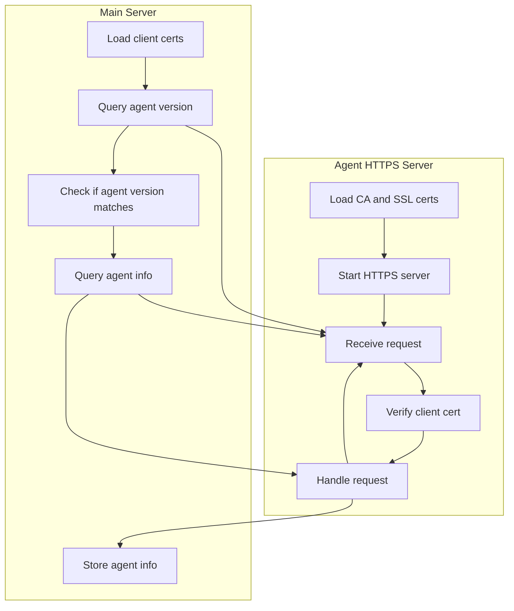

## GoDoxy v0.10.0

### GoDoxy Agent

Maintain secure connection between main server and agent server by authenticating and encrypting connection with mTLS.

Main benefits:

- No more exposing docker socket: drops the need of `docker-socket-proxy`
- No more exposing app ports: fewer attack surface

  ```yaml
  services:
    app:
      ...
      # ports: # this part is not needed on agent server
      #  - 6789
  ```

- Secure: no one can connect to it except GoDoxy main server because of mTLS, plus connection is encrypted
- Fetch info from agent server, e.g. CPU usage, Memory usage, container list, container logs, etc... (to be ready for beszel and dockge like features in WebUI)

#### How to setup

Prerequisites:

- GoDoxy main server must be running

1. Create a directory for agent server, cd into it
2. Navigate to **Metrics tab** in WebUI, click **Add agent**, fill in required infomation then click **Copy docker compose**
3. Paste the docker compose into the agent server then start it with `docker compose up -d`

### How does it work

Run flow:


